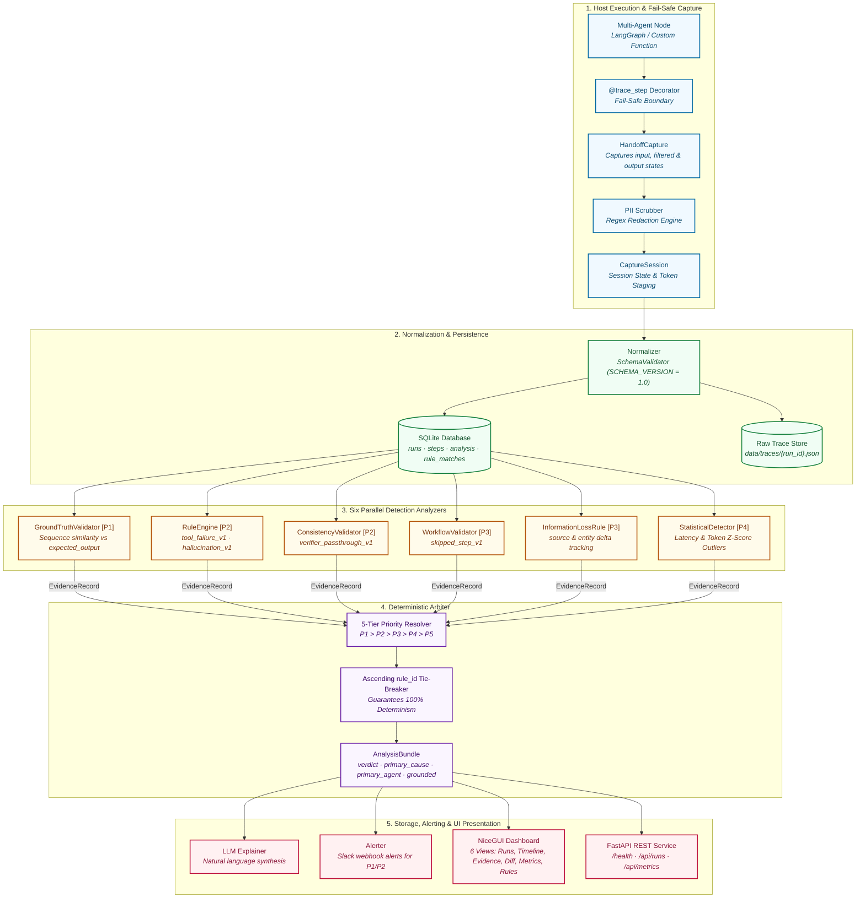

# AgentLens Architecture & Technical Specification (v1.0.0)

This document details the internal architecture, design guarantees, data flow, storage schema, and extensibility patterns of AgentLens.

---

## 1. System Design Principles

AgentLens is built around three core architectural tenets:

1. **Deterministic Attribution Over Probabilistic Guessing:**  
   LLM-based judges produce non-deterministic results that shift with temperature, model updates, and prompt phrasing. AgentLens resolves failure causes using deterministic, rule-based heuristics and a mathematically predictable priority order. The LLM is used strictly downstream to *explain* the deterministic finding.
2. **Fail-Safe Capture:**  
   Observability must never crash the workload it monitors. The `@trace_step` decorator and `CaptureSession` capture state, latency, and errors inside protective try-catch boundaries. If storage, serialization, or disk writes fail, the host pipeline executes unimpeded.
3. **Strict Priority Hierarchy ($P_1 \to P_5$):**  
   When multiple errors co-occur (e.g., an upstream hallucination followed by downstream verifier rubber-stamping), the Arbiter applies a strict priority ordering to isolate the primary root cause without human ambiguity.

---

## 2. End-to-End Architectural Pipeline & Data Flow



---

## 3. The 5-Tier Priority Resolution Hierarchy

The Arbiter resolves all collected `EvidenceRecord` items into a single final `AnalysisBundle` according to this strict ladder:

| Priority | Category | Evidence Source | Criteria | Default Verdict |
|---|---|---|---|---|
| **$P_1$** | **Grounded Failure** | `GROUND_TRUTH` | Direct factual contradiction against known ground truth | `FAIL` (grounded=True) |
| **$P_2$** | **Deterministic Rule** | `RULE_ENGINE`, `CONSISTENCY_VALIDATOR` | Execution crashes, missing tool output, severe hallucinations, verifier passthrough | `FAIL` (grounded=False) |
| **$P_3$** | **Workflow / Handoff** | `WORKFLOW_VALIDATOR`, `INFORMATION_LOSS` | Missing required agent, skipped nodes, moderate information loss/gain | `FAIL` (grounded=False) |
| **$P_4$** | **Statistical Anomaly** | `STATISTICAL_ANOMALY`, `METRICS_ANALYZER` | Latency or token consumption exceeds $>2.5\sigma$ of agent historical baseline | `FAIL` (grounded=True) |
| **$P_5$** | **Clean / Unknown** | None / Fallback | All checks passed, or no deterministic rule fired | `PASS` (or unknown) |

### Deterministic Tie-Breaking
If multiple pieces of evidence fire at the **same** priority tier (e.g., two $P_2$ rules fire: `hallucination_v1` on Writer and `verifier_passthrough_v1` on Verifier):
1. The Arbiter sorts candidate records alphabetically by `rule_id` ascending.
2. In the case above, `hallucination_v1` sorts before `verifier_passthrough_v1`.
3. The Arbiter crowns the upstream reasoning fault (`hallucination_v1`) as the primary cause, perfectly reflecting that downstream verifier passthrough was triggered by upstream corruption.
4. The exact same evidence list will yield the exact same verdict **100% of the time**.

---

## 4. Grounded vs. Heuristic Signals

AgentLens enforces a strict distinction in telemetry and reporting:

- **Grounded Attribution (`grounded = True`):**  
  The failure is verified against an objective anchor outside the LLM's opinion:
  - Factual mismatch against verified `expected_output` ($P_1$).
  - Mathematical statistical outlier exceeding $2.5\sigma$ of recorded population history ($P_4$).
- **Heuristic Attribution (`grounded = False`):**  
  The failure was inferred via behavioral rules and schema inspection ($P_2$, $P_3$). While highly accurate, it represents structural inference rather than mathematical ground-truth proof.

---

## 5. Storage Architecture & Alembic Schema

AgentLens stores telemetry in SQLite (`data/agentlens.db` by default, configurable via `DB_PATH` or `config.yaml`):

```sql
-- Core execution tables
runs (
    run_id TEXT PRIMARY KEY,
    workflow TEXT NOT NULL,
    timestamp TEXT NOT NULL,
    status TEXT NOT NULL,
    total_latency_ms REAL,
    total_tokens INTEGER,
    schema_version TEXT,
    trace_path TEXT,
    trace_json TEXT,
    expected_output TEXT
);

steps (
    id INTEGER PRIMARY KEY AUTOINCREMENT,
    run_id TEXT NOT NULL REFERENCES runs(run_id),
    step INTEGER NOT NULL,
    agent TEXT NOT NULL,
    status TEXT NOT NULL,
    latency_ms REAL,
    tokens_prompt INTEGER,
    tokens_completion INTEGER,
    tokens_total INTEGER,
    diff_summary TEXT,
    error TEXT,
    timestamp TEXT NOT NULL,
    schema_version TEXT,
    UNIQUE (run_id, step)
);

-- Analysis & Observability tables
analysis (
    id INTEGER PRIMARY KEY AUTOINCREMENT,
    run_id TEXT NOT NULL REFERENCES runs(run_id),
    step INTEGER,
    analyzer TEXT NOT NULL,
    category TEXT,
    verdict TEXT,
    confidence REAL,
    details_json TEXT,
    timestamp TEXT NOT NULL,
    schema_version TEXT
);

rule_matches (
    id INTEGER PRIMARY KEY AUTOINCREMENT,
    run_id TEXT NOT NULL REFERENCES runs(run_id),
    rule_id TEXT NOT NULL,
    rule_version TEXT NOT NULL,
    category TEXT NOT NULL,
    severity TEXT NOT NULL,
    agent TEXT,
    step_idx INTEGER,
    description TEXT,
    evidence_detail TEXT,
    timestamp TEXT NOT NULL
);

-- Performance Indexes (Alembic-managed)
CREATE INDEX ix_runs_timestamp ON runs (timestamp);
CREATE INDEX ix_steps_run_id ON steps (run_id);
CREATE INDEX ix_analysis_run_id ON analysis (run_id);
CREATE INDEX ix_rule_matches_run_id ON rule_matches (run_id);
CREATE INDEX ix_rule_matches_rule_id ON rule_matches (rule_id);
```

Database migrations are tracked via Alembic (`alembic/versions/`). Full test coverage guarantees that `upgrade("head")` and `downgrade("base")` execute cleanly.

---

## 6. How to Add a New Detection Rule

Adding a new deterministic failure rule takes 3 simple steps:

### Step 1: Register in `analyzers/rule_catalog.py`
```python
RuleDefinition(
    rule_id="custom_retry_loop_v1",
    version="1.0.0",
    category=FailureCategory.WORKFLOW,
    severity=RuleSeverity.MEDIUM,
    description="Agent entered an unconstrained retry loop exceeding max iterations.",
    priority=PriorityLevel.P3,
)
```

### Step 2: Implement Logic in the Target Analyzer
Implement the check inside `RuleEngine.analyze()`, `WorkflowValidator.analyze()`, or a dedicated analyzer:
```python
if agent_retry_count > max_retries:
    evidence.append(
        EvidenceRecord(
            source=EvidenceSource.WORKFLOW_VALIDATOR,
            description=f"Agent '{step.agent}' retried {agent_retry_count} times.",
            value="FAIL",
            rule_match=RuleMatch(
                rule_id="custom_retry_loop_v1",
                category=FailureCategory.WORKFLOW,
                severity=RuleSeverity.MEDIUM,
                agent=step.agent,
                step_idx=step.step,
                description="Retry loop exceeded limit.",
            ),
            agent=step.agent,
            confidence=1.0,
        )
    )
```

### Step 3: Run the Verification Suite
Ensure unit tests and the frozen benchmark pass:
```bash
pytest tests/ -v
python scripts/run_day43_regression.py
```
The regression runner will automatically verify that your new rule did not cause unintended verdict drift across the 20 benchmark traces.
