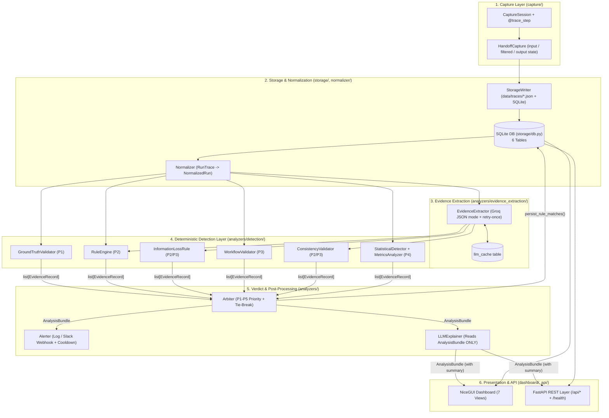
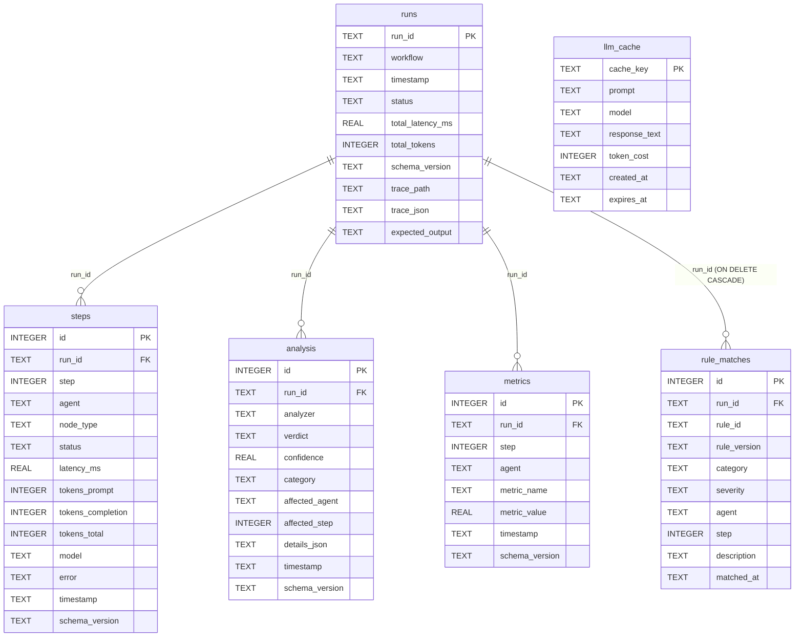

# AgentLens Architecture Guide

**Schema Version:** `1.0`

AgentLens is a deterministic-first observability and root-cause attribution platform for multi-agent LLM pipelines. Its core invariant is:

> **Same evidence in $\rightarrow$ same verdict out, every time.**
> The LLM is never used to decide whether a run failed or which agent is responsible—it is only used (1) in bounded JSON-mode evidence extraction of unstructured agent outputs and (2) *after* the Arbiter has produced a deterministic `AnalysisBundle`, to narrate the root cause in plain English.

---

## 1. End-to-End Component Diagram



---

## 2. Data Flow & Component Contracts

Every layer communicates exclusively through typed Pydantic v2 models (`schema/models.py`) or dataclasses (`normalizer/normalizer.py`). Raw untyped dicts never cross layer boundaries.

| Stage | Module / Class | Input Type | Output Type | Responsibility |
|---|---|---|---|---|
| **1. Capture** | `capture/session.py` (`CaptureSession`), `capture/tracer.py` (`@trace_step`), `capture/handoff.py` (`HandoffCapture`) | Live LangGraph / Python agent execution | `RunTrace` containing ordered ` list[AgentStep]` + `HandoffState` | Wraps each agent invocation, records latency, token counts (`TokenUsage`), tool calls, and three-stage state snapshots (`input_state`, `filtered_state`, `output_state`). |
| **2. Storage** | `storage/writer.py` (`StorageWriter`), `storage/db.py` (`DatabaseManager`) | `RunTrace` | SQLite rows (`runs`, `steps`, `metrics`) + `data/traces/{run_id}.json` | Writes the full trace JSON blob to disk and indexes metadata and step metrics in SQLite. |
| **3. Normalizer** | `normalizer/normalizer.py` (`Normalizer`) | `RunTrace` | `NormalizedRun` (`list[NormalizedStep]`) | Deserializes JSON strings safely (`safe_loads`), enforces UTC-aware timestamps, stamps `schema_version = "1.0"`, and guarantees JSON-serializable state dicts. |
| **4. Evidence Extractor** | `analyzers/evidence_extraction/extractor.py` (`EvidenceExtractor`) | `raw_output: str`, `agent: str` | `ExtractedEvidence` | Calls Groq LLM (with SQLite `LLMCache`, fallback model, and 1x stricter-prompt retry) to extract structured counts and lists: `source_count`, `entity_count`, `tool_calls`, `claims`, `references`, `numbers`, `dates`. Sets `extraction_failed=True` on double failure so downstream rules skip gracefully. |
| **5a. Ground Truth** | `analyzers/detection/ground_truth.py` (`GroundTruthValidator`) | `RunTrace` (with `expected_output`) | `AnalysisResult` (`list[EvidenceRecord]` at **P1**) | Compares final output against `expected_output`. Fires `gt_mismatch_v1` (`grounded=True`) when similarity falls below `p1_similarity_threshold`. |
| **5b. Rule Engine** | `analyzers/detection/rule_engine.py` (`RuleEngine`) | `RunTrace` + `ExtractedEvidence` | `AnalysisResult` (`list[EvidenceRecord]` at **P2**) | Evaluates deterministic execution and reasoning rules (`missing_tool_output_v1`, `tool_failure_v1`, `researcher_quality_v1`, `hallucination_v1`). |
| **5c. Information Loss** | `analyzers/detection/information_loss.py` (`InformationLossRule`) | `researcher: ExtractedEvidence`, `writer: ExtractedEvidence` | `InformationLossResult` $\rightarrow$ `EvidenceRecord` (**P2**) | Detects dropped sources/entities between Researcher and Writer (`information_loss_v1`). |
| **5d. Workflow Validator** | `analyzers/detection/workflow_validator.py` (`WorkflowValidator`) | `RunTrace` | `AnalysisResult` (`list[EvidenceRecord]` at **P3**) | Validates agent execution topology against `arbiter.workflow.required_agents` (`skipped_step_v1`, `wrong_order_v1`). |
| **5e. Consistency Validator** | `analyzers/detection/consistency_validator.py` (`ConsistencyValidator`) | `RunTrace` + `ExtractedEvidence` | `AnalysisResult` (`list[EvidenceRecord]` at **P3**) | Detects verifier false-approvals and factual drift (`verifier_passthrough_v1`, `claim_drift_v1`). |
| **5f. Statistical Detector** | `analyzers/detection/statistical_detector.py` (`StatisticalDetector`) | `run_id: str` + historical DB steps | `StatisticalAnomalyReport` (`list[EvidenceRecord]` at **P4**) | Computes per-agent z-scores across historical runs (`min_runs_for_baseline = 5`). Emits `STAT-LAT-*` and `STAT-TOK-*` when latency or tokens exceed $\mu + 2.5\sigma$. |
| **5g. Diff Engine** | `diff_engine/` (`GraphAligner`, `SemanticSimilarityEngine`) | `trace_a: RunTrace`, `trace_b: RunTrace` | `AlignmentResult` + `SimilarityReport` | Aligns steps across two runs by agent topology (`MATCHED`, `MISSING_IN_A`, `MISSING_IN_B`) and computes `all-MiniLM-L6-v2` cosine similarity to pinpoint `first_divergence_agent`. |
| **6. Arbiter** | `analyzers/arbiter.py` (`Arbiter`) | `run_id: str`, `list[EvidenceRecord]` | `AnalysisBundle` | Resolves all evidence into a single deterministic verdict using strict priority ordering (`P1 > P2 > P3 > P4 > P5`) and ascending `rule_id` tie-breaking. |
| **7. Alerter** | `analyzers/alerter.py` (`Alerter`) | `run_id: str`, `AnalysisBundle` | `bool` (writes `logs/alerts.log` or POSTs Slack webhook) | Fires alerts when `bundle.priority_level` is in `alerting.on_verdict` (`[P1, P2]`), subject to per-run `cooldown_minutes`. |
| **8. LLM Explainer** | `analyzers/explainer.py` (`LLMExplainer`) | `AnalysisBundle` | `AnalysisBundle` (with `summary` populated) | Generates a plain-English root-cause explanation strictly from `AnalysisBundle`. Uses hedged language when `bundle.grounded == False`. |
| **9. Dashboard & API** | `dashboard/app.py`, `dashboard/state.py`, `api/router.py` | SQLite DB + `AnalysisBundle` | 7 NiceGUI pages + 6 REST endpoints | Interactive Run Explorer, Vertical State-Diff Timeline, Evidence View, Explain View, Diff Viewer, Rule Explorer (`/rules`), Aggregate Metrics (`/metrics`), and `/api/*` JSON endpoints. |

---

## 3. Database Schema Diagram

All 6 tables are managed by `DatabaseManager.initialize()` in [`storage/db.py`](file:///C:/Users/Ankita%20Ghosh/OneDrive/Documents/AgentLens/AgentLensCode/storage/db.py) using `CREATE TABLE IF NOT EXISTS` with foreign keys enabled (`PRAGMA foreign_keys = ON`).



---

## 4. How to Add a New Deterministic Rule (Step-by-Step)

Suppose you want to add a new reasoning rule `citation_url_missing_v1` that flags the Writer if it produces references without any URLs.

### Step 1: Add any configurable thresholds to `config/config.yaml`
Never hardcode thresholds in rule code. Add the setting under `arbiter.reasoning` in [`config/config.yaml`](file:///C:/Users/Ankita%20Ghosh/OneDrive/Documents/AgentLens/AgentLensCode/config/config.yaml):
```yaml
arbiter:
  reasoning:
    researcher_min_sources: 1
    hallucination_entity_gain_threshold: 0
    require_url_in_references: true   # <-- new threshold
```

### Step 2: Register the rule in `analyzers/rule_catalog.py`
Add the metadata entry to `RULE_CATALOG` in [`analyzers/rule_catalog.py`](file:///C:/Users/Ankita%20Ghosh/OneDrive/Documents/AgentLens/AgentLensCode/analyzers/rule_catalog.py) so it appears automatically in the `/rules` Rule Explorer (even before it fires for the first time):
```python
    "citation_url_missing_v1": {
        "name": "Missing Citation URL",
        "category": "reasoning",
        "version": "1.0.0",
        "description": "Writer cited references but none contained an explicit URL.",
        "source": "rule_engine",
    },
```

### Step 3: Implement the check in the appropriate detector
Open [`analyzers/detection/rule_engine.py`](file:///C:/Users/Ankita%20Ghosh/OneDrive/Documents/AgentLens/AgentLensCode/analyzers/detection/rule_engine.py) (or `workflow_validator.py` / `consistency_validator.py` depending on category). Inside `RuleEngine.analyze()`, check `not wr_ev.extraction_failed` first (to preserve graceful degradation), then append an `EvidenceRecord` using `self._make_record()`:
```python
require_url = reasoning_config.get("require_url_in_references", False)
if require_url and wr_step and wr_ev and not wr_ev.extraction_failed:
    if wr_ev.references and not any("http" in r for r in wr_ev.references):
        evidence.append(
            self._make_record(
                rule_id="citation_url_missing_v1",
                category=FailureCategory.REASONING,
                description="Writer references contain no URLs.",
                agent="writer",
                step_idx=wr_step.step,
            )
        )
```
> **Note on rule versioning & staleness:** When modifying the logic of an existing rule, bump its `rule_version` (e.g. `"1.0.0"` $\rightarrow$ `"1.1.0"`). The Run Explorer compares stored verdict versions and displays a `⚠ Stale` badge on runs analyzed under older versions.

### Step 4: Add unit tests
Add a positive test, negative test, and `extraction_failed=True` skip test in `tests/test_rules.py`.

---

## 5. How to Add a New Agent Extractor or Extraction Field (Step-by-Step)

AgentLens extracts structured facts from unstructured agent prose in a single JSON-mode LLM call per step via [`analyzers/evidence_extraction/extractor.py`](file:///C:/Users/Ankita%20Ghosh/OneDrive/Documents/AgentLens/AgentLensCode/analyzers/evidence_extraction/extractor.py).

### Case A: Adding a new extracted field across steps
1. **Update `config/config.yaml`**: Add the field name under `extraction.fields`.
2. **Extend `ExtractedEvidence`** in [`analyzers/evidence_extraction/extractor.py`](file:///C:/Users/Ankita%20Ghosh/OneDrive/Documents/AgentLens/AgentLensCode/analyzers/evidence_extraction/extractor.py):
   Always provide a safe default so existing callers and cached payloads remain valid:
   ```python
   sentiment: str = Field(
       default="neutral",
       description="Overall tone of the output: positive | neutral | negative",
   )
   ```
3. **Update `_SYSTEM_PROMPT`**: Add the field definition and include it in the JSON return template inside `_SYSTEM_PROMPT`.
4. **Update `_parse_response()` and `_build_evidence()`**: Validate the field type in `_parse_response()` and pass it into `ExtractedEvidence(...)` in `_build_evidence()`.

### Case B: Adding a new agent role to the pipeline
1. **Decorate the agent function** in [`app/pipeline.py`](file:///C:/Users/Ankita%20Ghosh/OneDrive/Documents/AgentLens/AgentLensCode/app/pipeline.py) with `@trace_step(agent_name="fact_checker", node_type=NodeType.LLM)` and record its state handoff via `HandoffCapture`.
2. **Register required workflow order** (if mandatory) in [`config/config.yaml`](file:///C:/Users/Ankita%20Ghosh/OneDrive/Documents/AgentLens/AgentLensCode/config/config.yaml) under `arbiter.workflow.required_agents`.
3. **Extract step evidence in `dashboard/state.py` and Detectors**:
   `EvidenceExtractor.extract(step.raw_output, agent=step.agent)` is already called for **every** step in `norm.steps` during `run_full_analysis()` (`state.extracted[step.agent] = ev`). To write cross-agent rules for the new agent:
   - Retrieve `fc_ev = state.extracted.get("fact_checker")` (or in `RuleEngine.analyze()`, find steps where `s.agent == "fact_checker"`).
   - Guard with `if fc_ev and not fc_ev.extraction_failed:` before evaluating rules.
4. **Add agent color styling** in [`dashboard/theme.py`](file:///C:/Users/Ankita%20Ghosh/OneDrive/Documents/AgentLens/AgentLensCode/dashboard/theme.py) under `STEP_COLOR`:
   ```python
   STEP_COLOR = {
       "researcher": "#3b82f6",
       "writer": "#8b5cf6",
       "verifier": "#10b981",
       "fact_checker": "#f59e0b",
   }
   ```
