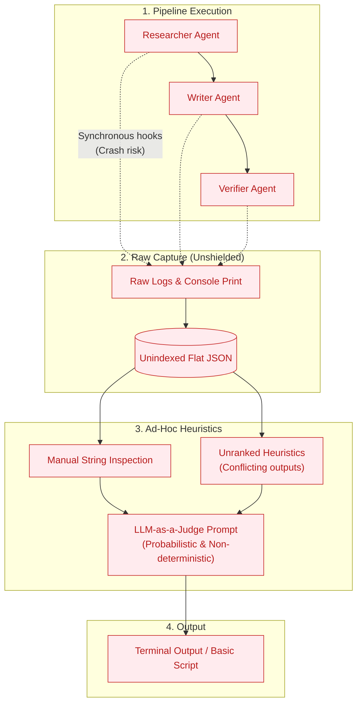
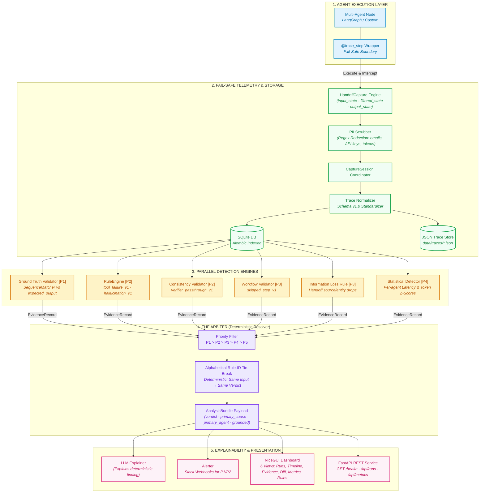

# AgentLens v1.0.0

[](https://github.com/Phoenixcoder-6/AgentLens/actions/workflows/ci.yml)
[](https://www.python.org/downloads/)
[](LICENSE)
[](https://github.com/Phoenixcoder-6/AgentLens)
[](CHANGELOG.md)

**Multi-Agent Failure Attribution, Trace Diffing & Explainability Platform**

AgentLens answers a single question with mathematical precision:  
*Why did a multi-agent workflow fail, and which agent was responsible?*

> **Core Philosophy:**  
> The LLM never decides what happened — it only explains what deterministic analysis has already proven.

---

## 1. Why AgentLens?

When complex LLM agent swarms fail (hallucinating facts, dropping instructions, crashing tools, or rubber-stamping bad output), debugging with standard logs or APMs is overwhelming:
- Traditional tracing tools (Datadog, OpenTelemetry) record *latencies* and *spans*, but understand nothing about *agent semantics*, *handoff contracts*, or *reasoning integrity*.
- LLM-as-a-judge approaches are probabilistic, non-deterministic, and frequently hallucinate their own blame attributions.

**AgentLens introduces Deterministic Multi-Tier Failure Attribution:**
1. **Deterministic Rule Engine (P1–P3):** Isolates the exact faulty agent using verifiable rules (tool failures, information loss/gain, step omission, verifier passthrough).
2. **Deterministic 5-Tier Arbiter:** Guarantees that the exact same evidence always yields the exact same verdict ($P_1 \to P_5$).
3. **Graph-Aligned Trace Diffing:** Aligns multi-agent execution traces step-by-step to pinpoint the exact moment two runs diverged.
4. **Grounded vs. Heuristic Separation:** Clearly flags whether a failure was proven against external ground-truth ($P_1$) or detected via behavioral heuristics ($P_2–P_4$).

---

### 2. Architecture: Evolution from Legacy Prototype to v1.0.0 Production

AgentLens evolved from a simple linear capture script with manual error guessing into a production-grade, fail-safe observability and deterministic failure attribution platform.

### Phase 1: Legacy Early Architecture (v0.1 Prototype)
In the initial prototype, tracing was synchronous and unshielded. Detection relied on basic post-hoc parsing with unranked, conflicting heuristic outputs and no tie-break determinism:



---

### Phase 2: Current Production Architecture (v1.0.0 Enterprise Core)
v1.0.0 introduces a fail-safe capture envelope, canonical normalization, 6 multi-tier detection analyzers, the deterministic 5-tier Arbiter ($P_1 \to P_5$), and dual presentation interfaces (NiceGUI + FastAPI):



---

### Architectural Comparison: Prototype vs. v1.0.0 Production

| Dimension | Legacy Prototype (v0.1) | AgentLens v1.0.0 Production |
|---|---|---|
| **Pipeline Safety** | Unhandled logging crashes pipeline | **Fail-Safe Envelope**: telemetry errors are trapped; pipeline never fails |
| **Privacy & Security** | Plaintext state dump to disk | **PII Scrubber**: automated redaction of emails, API keys, bearer tokens |
| **Attribution Logic** | LLM-as-a-judge probabilistic guesswork | **Deterministic Arbiter**: strict 5-tier priority ladder with rule-id tie-breaking |
| **Co-occurrence Handling**| Conflicting rules produce chaotic alerts | **Upstream Root-Cause Prioritization**: upstream errors take precedence |
| **Ground Truth Support** | None (pure heuristic) | **Explicit Grounded Boundary**: $P_1$ factual contracts vs. $P_2–P_4$ structural heuristics |
| **Storage Engine** | Flat unstructured JSON files | **Indexed SQLite + Alembic Migrations**: 5 performance indexes & schema versioning |
| **Delivery Interfaces** | Terminal CLI script only | **NiceGUI Interactive Dashboard (6 Views) + FastAPI REST API + Docker** |

---

## 3. Quickstart (Zero-Setup in 3 Commands)

### Option A: Local Python Package Installation

```bash
# 1. Install editable package
pip install -e .

# 2. Seed pre-computed zero-setup demo traces (PASS, Grounded P1, Heuristic P2/P3, Diff Pairs)
agentlens-seed

# 3. Launch the AgentLens interactive dashboard
agentlens-dashboard
```
Open **`http://localhost:8080`** in your browser.

---

### Option B: One-Command Docker Setup

```bash
docker compose up --build
```
The NiceGUI dashboard and FastAPI REST endpoints are exposed at **`http://localhost:8080`**.  
Liveness/readiness is monitored via `GET http://localhost:8080/health`.

---

## 4. Benchmark Accuracy & Validation

AgentLens is evaluated on a frozen 20-trace benchmark (`sample_data/labels.json`) covering clean runs, tool crashes, reasoning hallucinations, skipped nodes, and verifier bypasses:

| Metric | Target | Verified Actual | Status |
|---|---|---|---|
| **Binary PASS / FAIL Detection** | $\ge 90\%$ | **100.0%** (20/20) | **PASS** |
| **Exact Category & Agent Attribution** | $\ge 75\%$ | **80.0%** (16/20) | **PASS** |
| **Test Suite Code Coverage Gate** | $\ge 75\%$ | **93.0%** | **PASS** |
| **Type Checking (`mypy`)** | Strict PEP 561 | **0 issues** (46 source files) | **PASS** |
| **Formatting & Linting (`ruff`)** | Clean | **0 issues** | **PASS** |

Continuous regression testing is enforced on every PR to `main` via [`.github/workflows/ci.yml`](.github/workflows/ci.yml).

---

## 5. REST API

AgentLens includes a built-in FastAPI REST service mounted at `/api` and `/health`:

| Method | Endpoint | Description |
|---|---|---|
| `GET` | `/health` | Liveness & readiness check (`status`, `db`, `llm`, `uptime_seconds`) |
| `GET` | `/api/runs` | List recorded runs with pagination & verdict level filters |
| `GET` | `/api/runs/{run_id}` | Full trace details including per-agent steps & state diffs |
| `GET` | `/api/runs/{run_id}/verdict` | Final Arbiter verdict bundle & primary cause |
| `POST` | `/api/analyze/{run_id}` | Trigger deterministic analysis on an existing trace |
| `GET` | `/api/metrics` | Aggregated latency, token, and run counts per agent |

Interactive Swagger documentation is available at `http://localhost:8080/docs`.

---

## 6. Project Documentation Index

- **[ARCHITECTURE.md](ARCHITECTURE.md)**: Deep dive into the 5-tier Arbiter, component data flow, storage schema, and how to write custom rules.
- **[RULES.md](RULES.md)**: Exhaustive catalog of all built-in deterministic detection rules (P1–P4).
- **[LIMITATIONS.md](LIMITATIONS.md)**: Benchmark error analysis, scope boundaries, and dual-fault tie-break dynamics.
- **[CONTRIBUTING.md](CONTRIBUTING.md)**: Developer setup, test guidelines, pre-commit hooks, and PR workflow.
- **[CHANGELOG.md](CHANGELOG.md)**: Complete release history from v0.1.0 to v1.0.0.

---

## 7. License

AgentLens is open-source software licensed under the [MIT License](LICENSE).
